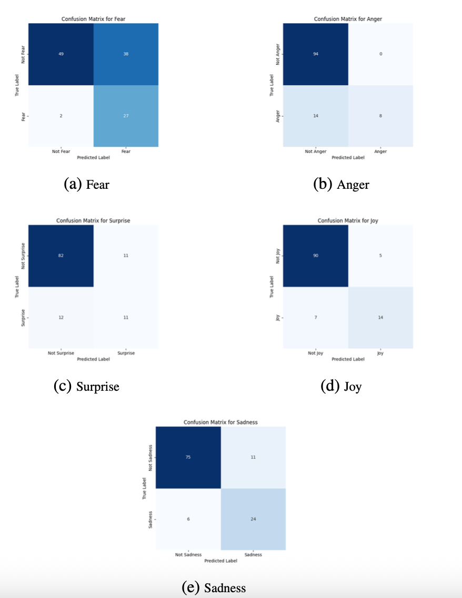

# Multi-Label Emotion Detection with Transformers
> This repository implements and compares transformer architectures for multi-label emotion classification over five emotions, Anger, Fear, Joy, Sadness, Surprise, and evaluates generalization from a model trained on GoEmotions to a simplified 5-label taxonomy. The codebase includes training, evaluation, threshold optimization, and analysis utilities.

## Background: 

**Task.** Multi-label emotion detection assigns **one or more** emotions to each input text. Unlike single-label sentiment, classes can overlap (e.g., *Fear* vs. *Surprise*), minority classes are common, and model calibration matters. A robust system therefore needs:
- an encoder capable of fine-grained semantics,
- a loss suitable for multi-label targets,
- careful decision thresholds rather than a fixed 0.5 cutoff.

**Models compared.**
- **BERT (`bert-base-uncased`, ~109M):** encoder-only; a strong baseline for classification tasks.  
- **BART (`facebook/bart-base`, ~139M):** encoder–decoder; bidirectional encoding with an autoregressive head.  
- **GPT-2 (`gpt2`, ~124M):** decoder-only; adapted to classification via a supervised head.

**Learning objective.** All models are fine-tuned for multi-label prediction using **BCEWithLogitsLoss** (via `problem_type="multi_label_classification"` or a custom trainer), which treats each emotion as an independent Bernoulli target.

**Thresholding.** Raw logits are converted to probabilities by sigmoid. A **per-label threshold search** (0.10 → 0.90 in steps of 0.05 on the dev set) maximizes F1 for each class and improves minority-class detection over a naive 0.5 cutoff.


## Data
- **`data/emotion_train.csv`:** 5-label training split with columns: `text, Anger, Fear, Joy, Sadness, Surprise` (binary indicators).  
- **`data/emotion_test.csv`:**  held-out test split with the same schema.  
- A transfer setting using GoEmotions (27 fine-grained labels) mapped into the 5-label taxonomy for comparison.

Corpus analysis (length distribution, label frequencies, and top co-occurrences) is provided under `src/analysis/` and produces both tables (Markdown) and plots.


## Setup
```bash
python3 -m venv .venv
source .venv/bin/activate
pip install -r requirements.txt

#BERT
python src/train_bert.py --train data/emotion_train.csv --dev data/emotion_test.csv --out results_bert
python src/eval/evaluate.py \
  --model runs/bert_base/final_model \
  --data  data/emotion_test.csv \
  --out   results/bert_eval

#BART
python src/train_bart.py --train data/emotion_train.csv --dev data/emotion_test.csv --out results_bart
python src/eval/evaluate.py \
  --model runs/bart_base/final_model \
  --data  data/emotion_test.csv \
  --out   results/bart_eval

#GPT
python src/train_gpt.py  --train data/emotion_train.csv --dev data/emotion_test.csv --out results_gpt
python src/eval/evaluate.py \
  --model runs/gpt2_base/final_model \
  --data  data/emotion_test.csv \
  --out   results/gpt2_eval

#Aggregate evaluation:
python src/eval_all.py \
  --truth data/emotion_test.csv \
  --bert results_bert/dev_predictions.csv \
  --bart results_bart/dev_predictions.csv \
  --gpt  results_gpt/dev_predictions.csv \
  --out  results/metrics/summary.txt
```
## Results:


| Model       | Accuracy  | Micro F1  | Macro F1  | Most-Predicted Emotion |
| ----------- | --------- | --------- | --------- | ---------------------- |
| **BERT**    | **0.397** | **0.613** | **0.608** | Fear                   |
| **BART**    | 0.345     | 0.573     | 0.562     | Fear                   |
| **GPT-2**   | 0.362     | 0.572     | 0.545     | Fear                   |
| GoEmotions* | 0.070     | 0.257     | 0.254     | Joy                    |

> GoEmotions row corresponds to a model fine-tuned on 27 labels and mapped to our five-label schema; its poor performance is largely due to label mismatch and domain shift.

**Overall performance:**
BERT provides the strongest overall results across accuracy and F1, consistent with encoder-only transformers’ strengths on classification tasks. BART is competitive but slightly behind. GPT-2 is viable with a classification head but trails on macro-F1, reflecting weaker minority-class handling.


**Class-level findings:**
-Joy: consistently high precision/recall; most stable class across models.
- Fear: frequently predicted and often over-called, improving recall but hurting precision.
- Surprise: fragile and frequently confused with Fear or Joy, especially for short texts and ambiguous contexts.
- Anger: short, abrupt expressions are occasionally missed or marked Neutral.
- Sadness: moderate and stable, with fewer extreme errors.

**Error patterns:**

- Ambiguous disbelief phrases (e.g., “I can’t believe this happened!”) were often scored as Fear rather than Surprise. Fear tends to be over-predicted, with BERT showing high recall but low precision on this class.
- Very short, abrupt expressions of Anger were missed or labeled Neutral. Anger is under-predicted, especially for short sentences that lack dense lexical cues.
- Surprise shows low precision/recall and confuses with Fear/Joy in celebratory or unexpected contexts. Excited Joy sometimes drifted into Surprise.


<p align="center">
  
</p>
<p align="center">
  Confusion Matrices for BERT Predictions.
</p>

BERT findings:
- Joy. The matrix is dominated by true positives with comparatively low false positives and false negatives. This mirrors the strong per-class metrics and indicates clear lexical and contextual cues for positive affect.
- Fear. False positives are the largest off-diagonal mass. Many disbelief/concern statements and safety-related mentions are assigned to Fear, which lifts recall but depresses precision—consistent with Fear being the “most predicted” class overall. A slightly higher decision threshold for Fear would reduce FP at a modest recall cost.
- Sadness. Errors are more balanced between misses and spurious activations. False negatives often occur in short or indirect expressions (e.g., implicit loss without overt affect terms). Context length and compositional cues matter here.
- Anger. Misses outweigh spurious activations (FN > FP). Brief, abrupt utterances and implicit sarcasm tend to be under-detected. Lowering the Anger threshold or applying class-balanced loss would raise recall.
- Surprise. False negatives dominate. Surprise is frequently confused with Fear (unexpected but negative) or with Joy (excited discovery). The matrix reflects this asymmetry and explains the relatively fragile F1 for Surprise.
  
The matrices indicate that thresholding is critical to reduce Fear FP by raising its threshold and improve Anger and Surprise recall by slightly lowering thresholds and/or adding class-balanced or focal loss.  

**Limitations and future work:**
Hyperparameter tuning was intentionally constrained for comparability. More extensive sweeps, class-balanced sampling, and calibration could further lift minority-class performance. For transfer, retraining on an aligned label schema or using multi-task learning would likely improve results.
